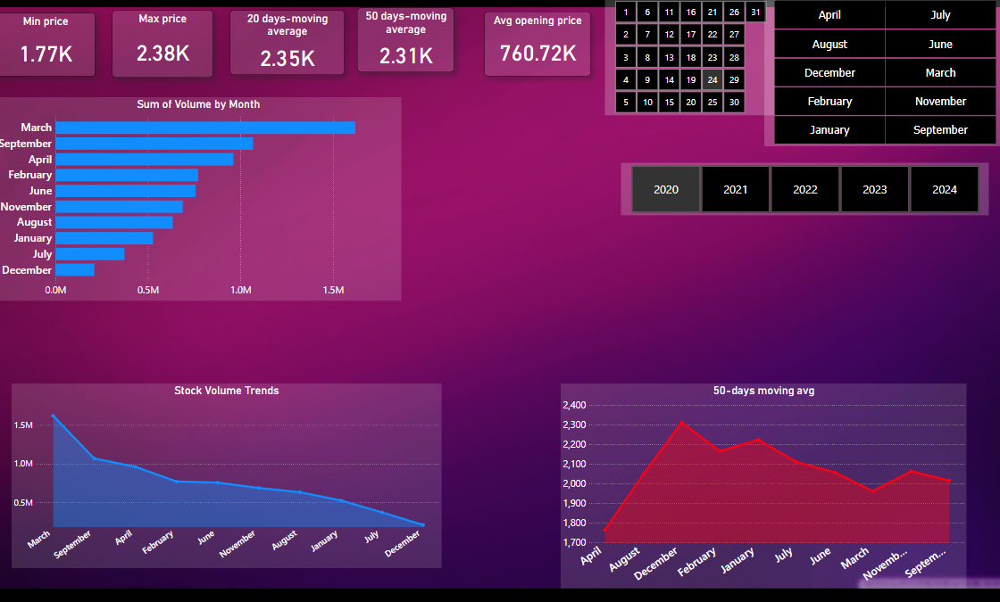

# Honda Stock Analysis Dashboard

## Overview

This Power BI project provides a comprehensive analysis of Honda Motor Co. stock performance from January 2020 to May 2024. The dashboard offers insights into trends, patterns, and key metrics related to the stock's historical performance, helping investors and analysts make informed decisions.

## Features

- **Daily Percentage Change**: Visualizes the daily percentage change in Honda's stock prices over time.
- **Volatility Analysis**: Analyzes the volatility of Honda's stock prices through rolling standard deviation calculations.
- **Interactive Heatmaps**: Provides dynamic heatmaps to visualize the daily percentage change and volatility analysis.
- **Comparative Analysis**: Compares Honda's stock performance with relevant market indices for benchmarking.
- **Customizable Filters**: Allows users to filter data by date range, specific events, and other relevant criteria for deeper analysis.

2. Open the `honda stock-price dashboard.pbix` file using Power BI Desktop.

3. Connect the Power BI file to your dataset or import data directly into Power BI.

4. Customize the dashboard visuals and layout according to your preferences.

5. Save and publish the dashboard to your Power BI service for online access and sharing.

## Usage

1. Open the Power BI dashboard to explore Honda's stock performance visually.

2. Interact with the dashboard by selecting different date ranges, filtering data, or drilling down into specific metrics.

3. Analyze trends, patterns, and correlations to gain insights into Honda's stock performance and make informed investment decisions.

## Data Sources

- The dataset used in this project contains historical stock price data for Honda Motor Co. (HMC) from January 1, 2020, to May 1, 2024. It includes daily opening, high, low, and closing prices, as well as adjusted closing prices and volume.

## Credits

- Special thanks to [kaggle] for providing the historical stock price data used in this analysis.

